# Achieving a Hill coefficient of 7 with just 3 binding sites, by nested hysteresis

**Jeremy A. Owen and Jordan M. Horowitz**

This Mathematica notebook accompanies our paper “Size limits sensitivity in all kinetic schemes”. It provides: (1) code to generate and manipulate kinetic schemes representing the mechanism we call “nested hysteresis” for any number of binding sites *n,* and **(2) a computer-assisted demonstration that in the case *n* = 3*,* nested hysteresis with stabilized extremes **can yield an input-output relationship that converges uniformly to a Hill function with *H* = 7.

```mathematica


```

**Generating nested hysteresis schemes**

Our starting point is the case n = 1, binding and unbinding from a single site.

```mathematica
base = Graph[{{0}, {1}}, {{0} -> {1}, {1} -> {0}}, EdgeWeight -> {x, 1}, EdgeLabels -> "EdgeWeight"]
```

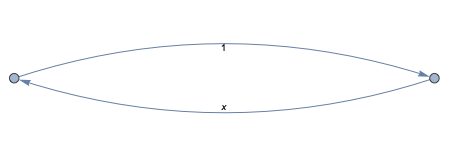

This function performs one step of the iterative construction shown in Figure 3(c) of the main text. The parameters x and s control the edge weights, and represent the ligand concentration and a temporal scaling factor, respectively.

```mathematica
IterativeStep[G_, s_, x_] := Module[{weights = PropertyValue[{G, #}, EdgeWeight] & /@ EdgeList[G], sortverts = SortBy[VertexList[G], Count[#, 1] &]}, Graph[((#~Join~{0}) & /@ VertexList[G])~Join~((#~Join~{1}) & /@ VertexList[G]), (Map[#~Join~{0} &, EdgeList[G], {2}]~Join~Map[#~Join~{1} &, EdgeList[G], {2}])~Join~{(First[sortverts]~Join~{1}) -> (First[sortverts]~Join~{0}), (Last[sortverts]~Join~{0}) -> (Last[sortverts]~Join~{1})}, EdgeWeight -> (s*weights)~Join~(s*weights)~Join~{1, x}]];
```

Here’s an illustration of 3 steps of the iterative construction, up to n = 4. Note that after n = 2, the automatic graph layout doesn’t look like a hypercube, but these are still (subgraphs of) hypercube graphs.

```mathematica
Graph[VertexList[#], EdgeList[#], GraphLayout -> "SpringEmbedding"] & /@ NestList[IterativeStep[#, s, x] &, base, 3]
```

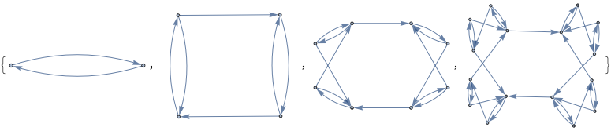

This function takes a nested hysteresis scheme (a stage of the iterative construction shown above), and scales the weights of transitions leaving the extreme states by a factor q.

```mathematica
StabilizeExtremes[G_, q_] := Module[{n = Round[N@Log[VertexCount[G]]/Log[2]], g}, g = Annotate[{G, ConstantArray[0, n] \[DirectedEdge] ({1}~Join~ConstantArray[0, n - 1])}, EdgeWeight -> (q*PropertyValue[{G, ConstantArray[0, n] \[DirectedEdge] ({1}~Join~ConstantArray[0, n - 1])}, EdgeWeight])]; Annotate[{g, ConstantArray[1, n] \[DirectedEdge] ({0}~Join~ConstantArray[1, n - 1])}, EdgeWeight -> (q*PropertyValue[{g, ConstantArray[1, n] \[DirectedEdge] ({0}~Join~ConstantArray[1, n - 1])}, EdgeWeight])]]
```


This function takes a weighted, directed graph and generates its transition rate matrix.

```mathematica
GraphLaplacian[graph_] := Transpose[(# - DiagonalMatrix[Total /@ #]) &@WeightedAdjacencyMatrix[graph]];
```


This function takes a transition rate matrix and finds the steady state distribution π.

```mathematica
SteadyState[L_] := #[[1]]/Total[#[[1]]] &@NullSpace[L];
```


As an illustration, we can find the rate matrix and steady state of the base case: binding to a single site, n = 1.

```mathematica
GraphLaplacian[base] // MatrixForm
SteadyState[GraphLaplacian[base]] // FullSimplify
```

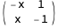

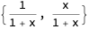


**The case** ***n*** **= 3**

Now let’s consider in depth the case *n* = 3. We build up the graph iteratively, with scale factor s, **and then stabilize extremes by a factor of q = 1/s. Our choice of a q with this particular dependence on s is partly a matter of convenience. It will give a “one-parameter” family of schemes (parameterized by s) that will approach the Hill function with H = 7 as s gets bigger and bigger. 

```mathematica
CaseN3 = StabilizeExtremes[Nest[IterativeStep[#, s, x] &, base, 2], 1/s];
```

Here are the vertices of this graph. The order they are listed in is the same as the order of the output of SteadyState. Note that the fully bound state is the last one.

```mathematica
VertexList[CaseN3]

(*{{0, 0, 0}, {1, 0, 0}, {0, 1, 0}, {1, 1, 0}, {0, 0, 1}, {1, 0, 1}, {0,1, 1}, {1, 1, 1}}*)
```

Now let’s find the steady state. We are interested in the probability of the fully bound state, so we will focus on the last entry of this list of steady state probabilities.

```mathematica
CaseN3 // GraphLaplacian // SteadyState // FullSimplify
```

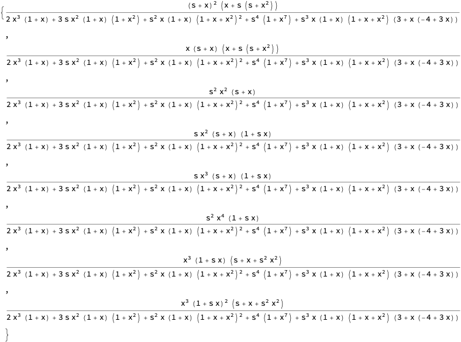

Now let’s find the steady state. We are interested in the probability of the fully bound state, so we will focus on the last entry of this list of steady state probabilities.

```mathematica
PFullyBound = Last[CaseN3 // GraphLaplacian // SteadyState // FullSimplify]
```

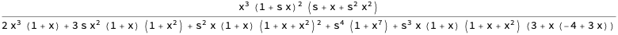


Now, here are some limits.

```mathematica
Limit[PFullyBound, s -> Infinity]
```

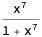

```mathematica
Limit[D[PFullyBound, x], s -> Infinity] // FullSimplify
```

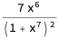

```mathematica
D[x^7/(1 + x^7), x] // FullSimplify(*for comparison to above*)
```


The evaluations above by Mathematica are reflective of the *pointwise* convergence (for any fixed value of x) of the fully bound probability (and its derivative) to the Hill function with H = 7 (and its derivative). However, it seems as though---consider the plots below---the convergence is actually uniform in x.

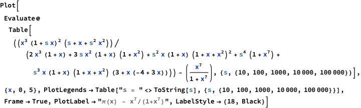

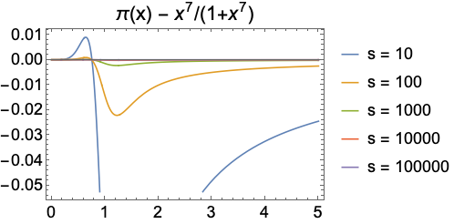

Below is a zoom in of the above

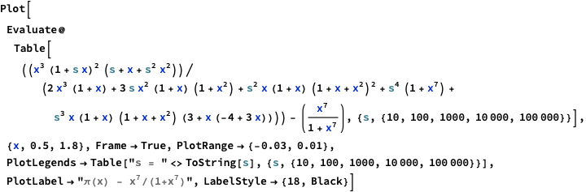

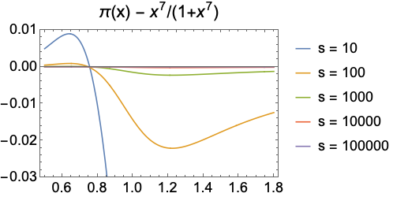


To establish uniform convergence, it is enough to show that the magnitude of the difference between these functions is bounded **independently of x** and decreases in s. The following evaluations by Mathematica provide evidence for just such a fact, suggesting that the magnitude of the difference is less than $1\left/s^{1/2}\right.$, no matter the value of x.


```
(*True*)
```

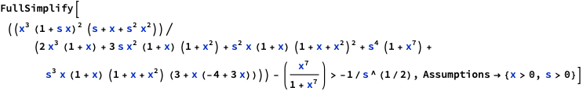

```
(*True*)
```


As a sanity check, changing $x^7/\left(1+x^7\right)$ to something different causes one or both of these evaluations to fail.


```
(*True*)
```


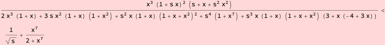


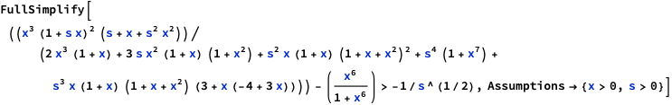

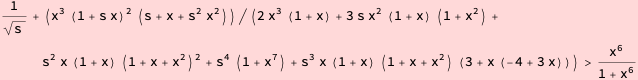


